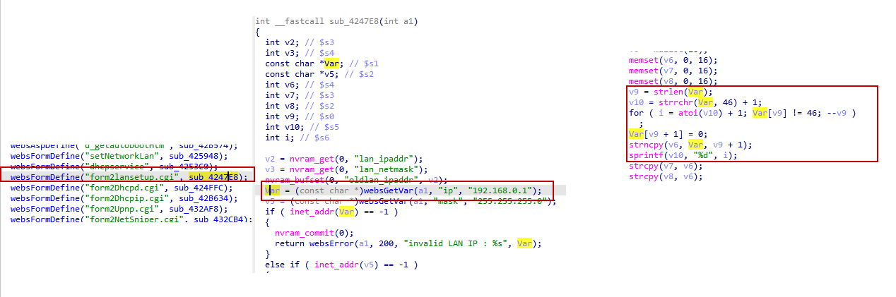

# DLink DIR816 stack overflow vulnerability
## Affected Version
DLink DIR816 1.10CNB05
## Vulnerability Description
In DLink DIR816 routers with firmware version 1.10CNB05, the ip parameter of route /goform/form2lansetup has a stack overflow vulnerability, which can lead to remote arbitrary code execution.
## Vulnerability Detail
There is a stack overflow vulnerability in the sub_4247E8 function in DLink DIR816 firmware 1.10CNB05. The function sub_4247E8, which is registered to handle the "form2lansetup.cgi" web form, accepts the ip parameter from a Web request via the variable Var. This untrusted input is then processed to extract the network portion of the IP address. However, because the function uses the length of the user-supplied string to perform a copy operation into a small local buffer without proper bounds checking, the statement strncpy(v6, Var, v9 + 1); leads to a stack-based buffer overflow. An attacker can provide an excessively long but "valid" IP string (for example, by using multiple leading zeros in the octets) that satisfies the inet_addr check but exceeds the 16-byte capacity of the v6 array, thus overwriting the stack frame and the saved return address.


## Poc
```py
POST /goform/form2lansetup HTTP/1.1
Host: 192.168.1.1
Connection: keep-alive
User-Agent: Mozilla/5.0 (Windows NT 10.0; WOW64) AppleWebKit/537.36 (KHTML, like Gecko) Chrome/86.0.4240.198 Safari/537.36
Cookie: curShow=

ip=192.168.0.00000000000000000000000000000001&mask=255.255.255.0&tokenid=1936217320
```
