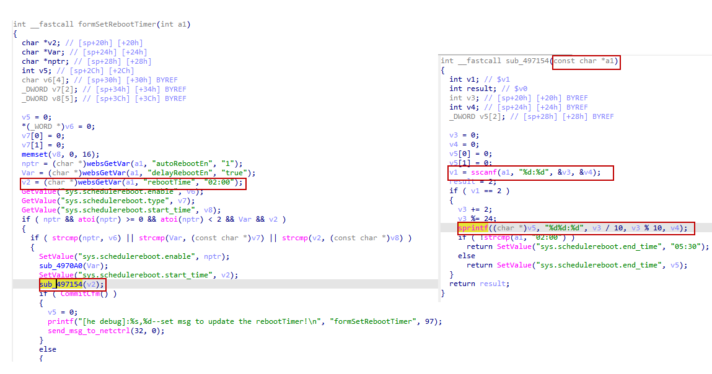

# Tenda AC9 V16.03.08.16 stack overflow vulnerability
## Affected Version
Tenda AC21 V1.0 V16.03.08.16
## Vulnerability Description
In Tenda ac21 V1.0 routers with firmware version V16.03.08.16, the rebootTime parameter of route /goform/SetSysAutoRebbotCfg has a stack overflow vulnerability, which can lead to remote arbitrary code execution.
## Vulnerability Detail
There is a stack overflow vulnerability in the formSetRebootTimer function in Tenda AC21 V1.0 firmware V16.03.08.16. The function formSetRebootTimer accepts the rebootTime parameter from a Web request via the variable v2. This untrusted input is then passed as an argument to the sub-function sub_497154. Inside the sub-function, the code parses numeric values from the input string using sscanf and then formats them into a new string using sprintf().
However, since the user has full control over the rebootTime input, they can provide very large numeric strings. The statement sprintf((char *)v5, "%d:%d", v3 / 10, v3 % 10, v4); leads to a stack-based buffer overflow because the target buffer v5 is defined as _DWORD v5[2], providing a total capacity of only 8 bytes. A formatted string containing large integers (e.g., "12345:67890") can easily exceed this 8-byte limit, overwriting the stack frame and the saved return address. This vulnerability can be exploited to trigger a Denial of Service (DoS) or achieve Remote Code Execution (RCE).


## Poc
```py
POST /goform/SetSysAutoRebbotCfg HTTP/1.1
Host: 192.168.0.1
Connection: keep-alive
User-Agent: Mozilla/5.0 (Windows NT 10.0; WOW64) AppleWebKit/537.36 (KHTML, like Gecko) Chrome/86.0.4240.198 Safari/537.36
Cookie: password=452b97084f53fd461f33687a27a21f4dpxatgb

rebootTime=111111111:111111111
```
